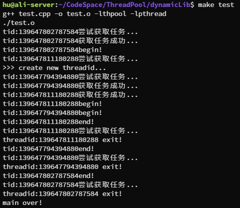

# MyThreadPool
## 项目介绍
本项目提供动态库及header-only支持的线程池，两种方式的线程池实现略有差别，但均支持用户向线程池提交带返回值的任务，且可选择线程池采用Fixed模式（线程数固定）抑或是Cached模式（线程数动态变化）：
* 对于动态库我们向用户提供**继承Task基类并重写run方法**的方式提交任务。
* 对于header-only库我们采用了可变数量参数的模板实现任务的提交，用户仅需编写任务函数并向线程池提交**函数名**即可。

## 项目构建

### 动态库
由于C++17 标准引入了结构化绑定和类模板推导，使编译器可以在某些情况下推断出成员变量的默认构造函数，有助于编译器更好地处理不可拷贝类型。故gcc版本需支持C++17方可编译成功，具体构建方法如下：

```shell
cd dynamicLib
make
make install
```

注意：对于某些Linux系统，`/usr/local/[lib|include]` 路径下的自定义头、库文件无法识别，可在`/etc/ld.so.conf.d/`文件夹下创建包含该库文件的新路径文件即可。

提供测试样例，可采用 `make test` 查看是否编译成功：



### Header-only
仅需在用户代码种包含头文件即可：`#include "threadpool.h"`。编译时需链接`pthread`库。

## 使用方法
### 动态库
任务建立方式：

```c
class MyTask : public Task
{
    public:
        MyTask() : {}
        Any run()
        {
            // 此处可自行编写任务逻辑
        }

    private:

};
```

任务添加及返回值获取：

```c
ThreadPool pool;
// 用户自己设置线程池的工作模式
pool.setMode(PoolMode::MODE_CACHED);
// 开始启动线程池
pool.start();

Result res1 = pool.submitTask(std::make_shared<MyTask>());
// 获取返回值
int sum1 = res1.get().cast_<int>();
```

### Header-only
向`submitTask`接口提交函数对象即可：
```c
ThreadPool pool;
pool.setMode(PoolMode::MODE_CACHED);
pool.start();

future<int> r = pool.submitTask([](int b, int e)->int {
    int sum = 0;
    for (int i = b; i <= e; i++)
        sum += i;
    return sum;
    }, 1, 100);

cout << r1.get() << endl;
```